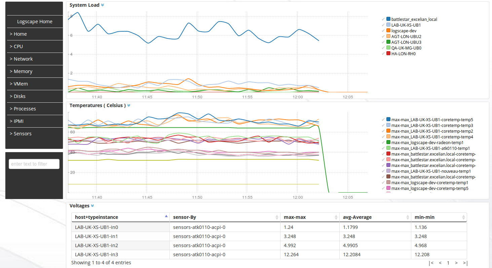
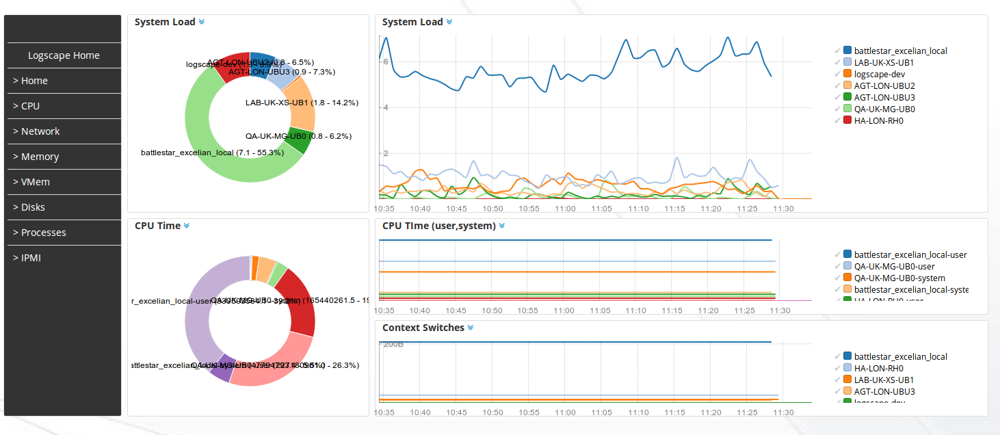
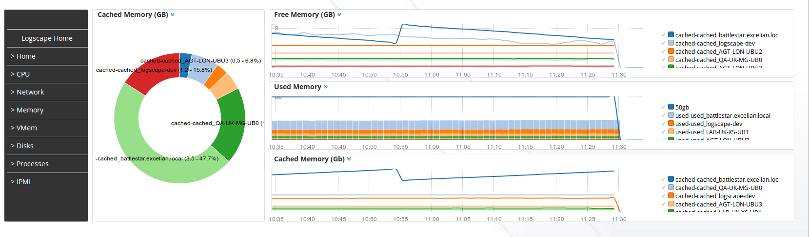

# CollectdApp-1.0 

Collectd is a monitoring daemon run on unix systems gathering system health metrics. The Collectd App provides Workspaces and a datatype mapping for collectd input plugins. 

## Downloads 

 * [CollectdApp](https://github.com/logscape/CollectdApp/raw/master/dist/CollectdApp-0.5.zip)


## Configuration

Logscape imports collectd data using the graphite write plugin. Most linux distributions will have this plugin installed. To configure update the Prefix and Postfix parameters of the graphite plugin as shown in the example below.


```xml
LoadPlugin write_graphite
<Plugin write_graphite>
  <Carbon>
    Host "10.28.1.159"
    Port "9991"
    Prefix "LOGSCAPETOKEN:-6e6e377b:149f1428863:-7fc6 LOGSCAPETAG:collectd type:collectd "
    Postfix ""
    StoreRates false
    AlwaysAppendDS false
    EscapeCharacter ""
  </Carbon>
</Plugin>
```

Replace Host with the hostname or ip address of your logscape installation. The LOGSCAPETOKEN and LOGSCAPETAG are used only when pointing collectd to Logscape Cloud. Replace LOGSCAPETOKEN with your unique token provided when you set up an account.


The LoadPlugin directive is required to enable the plugin. Restart collectd to start importing metrics into Logscape

The CollectdApp has 5 main categories.

 * Sensors - CPU Temperatures,Fan speed and so on  etc 
 * CPU - Cpu Utilization, Context Switching 
 * Memory - Memory Utilization, Caches, Virtual Memory stats such as page faults, paging in and out 
 * Network - Network Packets, Errors 
 * Disk - Disk Utilization, Operations and disk time ( what is reported by Collectd can not be trusted ) 

The other categories such as sensor and ipmi provide voltage and temperature metrics and depend on your hardware. The collectd data type is based on the Collectd schema for reporting metric data. See the [collectd naming schema](https://collectd.org/wiki/index.php/Naming_schema) for more. 

## Sample Screenshots


### Sensors

 

### System Load 

 

## Network 


## Memory 



### 

